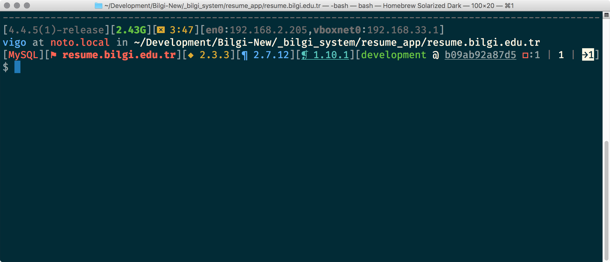
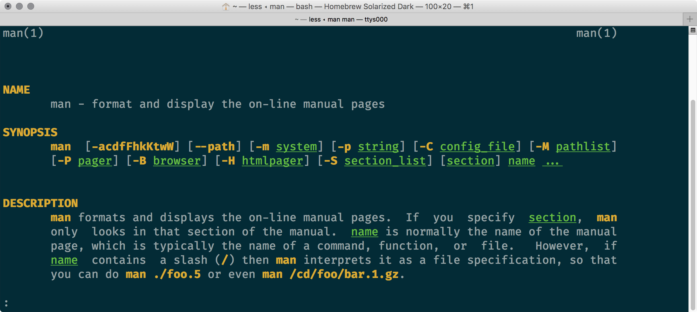

# Dotfiles “Fever”

My custom **BASH** environment. 1Supports **macOS**, **Ubuntu** and **Gentoo**. 
Feel free to fork and PR. Enjoy!

---

## Features

This is default look without any color configuration:


---

This is fancy look with fully colored:



---

**Common features**:

* Highly configurable `PS1` features and element colors!
* Enhanced `history`, formatted output, continuous history across terminal tabs.
* Auto included `PATH` information. `~/bin`, `/usr/local/sbin` and more.
* Auto load for `rbenv`, `pyenv`, `pip`
* Special prompts: **git**, **hg**, **ip_list**, **rbenv**, **python**/**pyenv**, **django**, **virtualenv**
* Bash completions: `bundler`, `django-admin`, `manage.py`, `gem`, `hg`, `rake`, `printev`, `pip`
* Nice `rc` files for: `gem`, `input`, `irb`, `pry`, `screen`
* Colorful file lists!
* Colorful `man` and `less` output

---

Example of `LS_COLORS`:


---

Example of colored `man` pages:



---

**OSX Only features**:

* Autoload for `brew`: brew completions and `autoenv`
* Bunch of useful `alias` examples.
* `rc` files for `ag`, `ack` and `nano`
* Linux style file list if `coreutils` installed from `brew` (*folders on top!*)

### Common aliases

Try these commands:

* `rm`, `mv`, `rmdir`, `mkdir`: You need to confirm!
* `cp`: Preserve attributes and copy verbose by default!
* `l`, `ll`, `la`: Nice Linux-ish (*well 100% same!*) lists.
* `what_is_my_public_ip`, `what_is_my_real_ip`: Using `dig` or `curl` can tell your real IP address!

### OSX aliases

* `desktop_hide`, `desktop_show`: You can show/hide all icons on your desktop via single command!
* `shadow_screenshot_disable`, `shadow_screenshot_enable`: Enable/disable shadows while taking screenshots!
* `ios_backup_disable`, `ios_backup_enable`: Enable/disable backups for your iOS device(s)
* `ds_store_clear`: Delete `.DS_Store` files :)
* `lock_screen`: Going for lunch? lock it asap!

### Common functions/commands

* `dataurl`: Data url for image file: `dataurl my_picture.jpg`
* `gz_analyse`: Analyses gzipped/non-gzipped versions of a file: `gz_analyse my_file.txt`
* `mkdir_cd`: Create folder and cd in to it: `mkdir_cd foo`
* `webserver`: That folder becomes a website! (*via python*): `cd /folder/;webserver`
* `webserver_rb`: That folder becomes a website! (*via ruby*): `cd /folder/;webserver`

---

## Requirements

You need `git` to clone this repo. That’s all you need. **OS X** users can install
git via: `brew install git`. **Ubuntu** users can install git via: 
`sudo apt install -y git-core`. **Gentoo** users can install git via:
`emerge dev-vcs/git`.

---

## Installation

Clone the repo and run install script.

```bash
git clone https://github.com/vigo/dotfiles-fever.git $HOME/Dotfiles
bash $HOME/Dotfiles/install.sh
exec $SHELL # reload baby!
```

Defaults are:

* `~/.profile`
* `~/.bashrc`
* `~/.inputrc`
* `~/.screenrc`

others are optional:

* `~/.ackrc` will be available if `ag` installed
* `~/.gemrc` will be available if `gem` executable exists
* `~/.irbrc` will be available if `irb` executable exists
* `~/.pryrc` will be available if `pry` gem exists

If you installed `nano` from `brew`, fulfilling nano configuration will be
generated and saved to `~/.nanorc`. Most of the install process is **sym-linking**
except nano configuration.

## Uninstallation

This will **unlink** all the symlinks. Will not delete `~/Dotfiles` folder.
Do it by your self please... Do not forget to check your `~/Dotfiles/private`
folder ok?

```bash
bash $HOME/Dotfiles/uninstall.sh
exec $SHELL # reload baby!
```


---

## Configuration

There is almost no-configuration :) There are few extras if you like to use. Put
all your custom / private stuff under `private/` folder. (*Root of the repo*)

    Dotfiles/
    ├── completions
    ├── private           ---> you private stuff!
    ├── ps1
    ├── rc
    ├── startup_sequence
    ├── LICENSE.txt
    ├── README.md
    └── install.sh

Everything under `private` folder will be loaded last therefore you can override
everything. There are two different `PS1` configuration options available:
`PS1_BASIC` and `PS1_ADVANCED`. Default `PS1` value is `PS1_BASIC`. You can
override it under `private/`. 

Here is my `private/` folder structure:

    private/
    ├── alias       # all of my private aliases
    ├── env         # my private env-vars/secrets etc...
    ├── functions   # my custom functions
    └── ps1         # my custom $PS1

If you want to customize your prompt shell, you need to know PS1 elements of this
dot-files :)

### PS1 ELEMENTS

### Color Configuration

You can set the color of every-bit in `PS1`. Available color and style variables 
are defined under `startup_sequence/common/ps1_colors`:

Colors are:

    ${black}
    ${red}
    ${green}
    ${yellow}
    ${blue}
    ${magenta}
    ${cyan}
    ${white}
    ${gray}

Styles are:

    ${bold}
    ${underline}
    ${reverse}
    ${blink}

You can even combine them:

```bash
export DFF_RBENV_PROMPT_COLOR="${bold}${yellow}${blink}"
```

Here is an example config and shows are the available variables. Example
file is available under `startup_sequence/ps_color_configuration_example`.
You can copy this under your `private/` folder.

```bash
# git/hg prompt
export DFF_REVCONTROL_BRANCH_COLOR="${green}"                      # master
export DFF_REVCONTROL_AT_SIGN_COLOR="${white}"                     # @
export DFF_REVCONTROL_COMMIT_ID_COLOR="${underline}"               # 4a449eb1d5e5
export DFF_REVCONTROL_UNTRACKED_COLOR="${red}"                     # □
export DFF_REVCONTROL_ADDED_COLOR="${yellow}${bold}"               # ■
export DFF_REVCONTROL_MODIFIED_COLOR="${green}"                    # ◆
export DFF_REVCONTROL_RENAMED_COLOR="${yellow}"                    # ◇
export DFF_REVCONTROL_DELETED_COLOR="${blink}${magenta}"           # ◌
export DFF_REVCONTROL_TYPECHANGED_COLOR="${cyan}"                  # ❖
export DFF_REVCONTROL_OVERALL_COLOR="${white}"                     #
export DFF_REVCONTROL_VERTICAL_PIPE_COLOR="${gray}"                # |
export DFF_REVCONTROL_GIT_BRANCH_AHEAD_COLOR="${reverse}${white}"  # →
export DFF_REVCONTROL_GIT_BRANCH_BEHIND_COLOR="${reverse}${white}" # ←

export DFF_RBENV_PROMPT_COLOR="${yellow}"                          # [◆ 2.3.3]

export DFF_DB_MYSQL_PROMPT_COLOR="${blink}${red}"                  # [MySQL]
export DFF_DB_POSTGRESQL_PROMPT_COLOR="${blink}${red}"             # [PG]

export DFF_PYTHON_PROMPT_COLOR="${blue}"                           # [¶ 2.7.12]
export DFF_DJANGO_PROMPT_COLOR="${cyan}${underline}"               # [❡ 1.10.1]
export DFF_VIRTUALENV_PROMPT_COLOR="${red}${bold}"                 # [⚑ resume.bilgi.edu.tr]

export DFF_BASH_INFO_PROMPT_COLOR="${gray}"                        # [4.4.5(1)-release]

export DFF_BATTERY_PROMPT_COLOR="${yellow}"                        # [⌧ 3:47]

export DFF_MEMORY_PROMPT_COLOR="${green}${bold}"                   # [2.43G]

export DFF_IPLIST_PROMPT_IFACE_COLOR="${gray}${bold}"              # [en0:192.168.2.205]
export DFF_IPLIST_PROMPT_IPADDR_COLOR="${gray}"

export DFF_HORIZONTAL_LINE_PROMPT_COLOR="${gray}"                  # [------]

export DFF_USER_HOSTNAME_USER_PROMPT_COLOR="${blue}"               # vigo at
export DFF_USER_HOSTNAME_HOSTNAME_PROMPT_COLOR="${red}"            # noto.local
export DFF_USER_HOSTNAME_CWD_PROMPT_COLOR="${white}"               # in ~
```


#### `${PROMPT_MEMORY}`
OSX only, displays remaining free memory: `[2.90G]`. Color variable is
`DFF_MEMORY_PROMPT_COLOR`

#### `${PROMPT_BATTERY}`
OSX only, displays remaining hour(s) on battery mode: `[2:05]`. Color variable is
`DFF_BATTERY_PROMPT_COLOR`. You can set a custom icon via setting 
`DFF_BATTERY_ICON` variable. Example:

    export DFF_BATTERY_ICON="\xE2\x8C\xA7" # ⌧

#### `${PROMPT_USER_AND_HOSTNAME}`
Outputs `USERNAME at HOSTNAME in CURRENT_WORKING_DIRECTORY`. Color variables are:

* `DFF_USER_HOSTNAME_USER_PROMPT_COLOR`
* `DFF_USER_HOSTNAME_HOSTNAME_PROMPT_COLOR`
* `DFF_USER_HOSTNAME_CWD_PROMPT_COLOR`

You can change the variables. See details (**osx/bsd**) via `man -P 'less -p ^PROMPTING' bash`

```bash
PROMPT_USER_AND_HOSTNAME="${DFF_USER_HOSTNAME_USER_PROMPT_COLOR}\u${COLOR_OFF} at ${DFF_USER_HOSTNAME_HOSTNAME_PROMPT_COLOR}\H${COLOR_OFF} in ${DFF_USER_HOSTNAME_CWD_PROMPT_COLOR}\w${COLOR_OFF}"

# vigo at noto.local in ~/Dotfiles
# \u at \H in \w
```


#### `${PROMPT_GIT}`
This works if you are under a git repository. Shows current status such as; added,
modified, deleted, renamed, type changed files amount. Example:

    [master @ 297c543ceac8 □:1 ◆:1 ◌:1 | 3]
       |      |            |   |   |     |
       |      |            |   |   |     +-> 3 files will be affected   
       |      |            |   |   +-------> 1 file is deleted
       |      |            |   +-----------> 1 file is modified
       |      |            +---------------> 1 file is untracked
       |      +----------------------------> commit id
       +-----------------------------------> current branch
    
    [development @ b09ab92a87d5 □:1 | 1 →1]
                                        |
                                        +--> this branch is ahead of 'origin/development'
                                             by 1 commit. you need to push it now! :)
    □ : untracked
    ■ : added
    ◆ : modified
    ◇ : renamed
    ◌ : deleted
    ❖ : type changed

git prompt also shows how many commit you are **ahead**/**behind** against your 
tracking remote. If you are in a **rebase**/**bare**/**conflict** mode, git prompt 
shows it to you :)

#### `${PROMPT_HG}`
Mercurial version of `${PROMPT_GIT}`. Example:

    [default @ b63bcee9d5ee+:1+ □:1 ■:2 ◌:2]
        |      |             |  |   |   |
        |      |             |  |   |   +--> 1 file is removed/deleted
        |      |             |  |   +------> 1 file is added
        |      |             |  +----------> 1 file is untracked
        |      |             +-------------> local revision number
        |      +---------------------------> global revision id
        +----------------------------------> current branch
        
    □ : untracked
    ■ : added
    ◆ : modified
    ◌ : deleted        

Color variables for `${PROMPT_GIT}` and `${PROMPT_HG}` are same:

* `DFF_REVCONTROL_BRANCH_COLOR`
* `DFF_REVCONTROL_AT_SIGN_COLOR`
* `DFF_REVCONTROL_COMMIT_ID_COLOR`
* `DFF_REVCONTROL_UNTRACKED_COLOR`
* `DFF_REVCONTROL_ADDED_COLOR`
* `DFF_REVCONTROL_MODIFIED_COLOR`
* `DFF_REVCONTROL_RENAMED_COLOR`
* `DFF_REVCONTROL_DELETED_COLOR`
* `DFF_REVCONTROL_TYPECHANGED_COLOR`
* `DFF_REVCONTROL_OVERALL_COLOR`
* `DFF_REVCONTROL_VERTICAL_PIPE_COLOR`
* `DFF_REVCONTROL_GIT_BRANCH_AHEAD_COLOR`
* `DFF_REVCONTROL_GIT_BRANCH_BEHIND_COLOR`

#### `${PROMPT_RBENV}`
Shows current Ruby version if you are using [rbenv](https://github.com/rbenv/rbenv).
Color variable is `DFF_RBENV_PROMPT_COLOR`.

    [◆ 2.3.3] # Ruby version 2.3.3 is active!

#### `${PROMPT_PYENV}`
Shows current Python and [Django](https://www.djangoproject.com/) versions if 
you are using [pyenv](https://github.com/yyuu/pyenv) or any existing python
binary. Color variables are: `DFF_PYTHON_PROMPT_COLOR` and `DFF_DJANGO_PROMPT_COLOR`.

    [¶ 2.7.12][❡ 1.10.1] # Python 2.7.12 is active!
                         # Django 1.10.1 is active!

#### `${PROMPT_VIRTUALENV}`
Shows current virtualenv information if you are using virtualenv. This would be
kool if you set this: `export VIRTUAL_ENV_DISABLE_PROMPT=1` somewhere in your
`private/` area...Color variable is `DFF_VIRTUALENV_PROMPT_COLOR`.

    [⚑ my_awesome_env] # :)

#### `${PROMPT_BASH_INFO}`
Shows current bash version. Color variable is `DFF_BASH_INFO_PROMPT_COLOR`.

    [4.4.5(1)-release] # I need to see this sometimes!

#### `${PROMPT_LIST_IPS}`
Shows current available local ip list. Color variables are `DFF_IPLIST_PROMPT_IFACE_COLOR`
and `DFF_IPLIST_PROMPT_IPADDR_COLOR`.

    [en0:192.168.2.205,vboxnet0:192.168.33.1]
    # name of interface: IP

#### `${PROMPT_DATABASE_STATUS}`
OSX only, shows if **MySQL** or **PostgreSQL** server is running. Color variables
are `DFF_DB_MYSQL_PROMPT_COLOR` and `DFF_DB_POSTGRESQL_PROMPT_COLOR`.

    [MySQL] # Helps you to remember is server is on/off

#### `${PROMPT_HORIZONTAL_LINE}`
Draws dashed line along the terminal width. This separates commands. Color
variable is `DFF_HORIZONTAL_LINE_PROMPT_COLOR`.

### PS1_BASIC

Default `PS1` is `PS1_BASIC`.

    # for OSX
    PS1_BASIC="${PROMPT_MEMORY}${PROMPT_BATTERY}
    ${PROMPT_USER_AND_HOSTNAME}
    ${PROMPT_GIT}${PROMPT_HG}
    $ "
    
    # for UBUNTU
    PS1_BASIC="${PROMPT_USER_AND_HOSTNAME}
    ${PROMPT_GIT}${PROMPT_HG}
    > "
    
    # for GENTOO
    PS1_BASIC="${PROMPT_USER_AND_HOSTNAME}
    ${PROMPT_GIT}${PROMPT_HG}
    > "

### PS1_ADVANCED

This includes almost everything :)

    # for OSX
    PS1_ADVANCED="${PROMPT_HORIZONTAL_LINE}
    ${PROMPT_BASH_INFO}${PROMPT_MEMORY}${PROMPT_BATTERY}${PROMPT_LIST_IPS}
    ${PROMPT_USER_AND_HOSTNAME}
    ${PROMPT_DATABASE_STATUS}${PROMPT_VIRTUALENV}${PROMPT_RBENV}${PROMPT_PYENV}${PROMPT_GIT}${PROMPT_HG}
    $ "
    
    # for UBUNTU
    PS1_ADVANCED="${PROMPT_HORIZONTAL_LINE}
    ${PROMPT_BASH_INFO}${PROMPT_LIST_IPS}
    ${PROMPT_USER_AND_HOSTNAME}
    ${PROMPT_VIRTUALENV}${PROMPT_RBENV}${PROMPT_PYENV}${PROMPT_GIT}${PROMPT_HG}
    > "
    
    # for GENTOO
    PS1_ADVANCED="${PROMPT_HORIZONTAL_LINE}
    ${PROMPT_BASH_INFO}${PROMPT_LIST_IPS}
    ${PROMPT_USER_AND_HOSTNAME}
    ${PROMPT_VIRTUALENV}${PROMPT_RBENV}${PROMPT_PYENV}${PROMPT_GIT}${PROMPT_HG}
    > "

Again, customize yours, create a file, such as `my_ps1` and put it under `private/`:

    export PS1="${PROMPT_USER_AND_HOSTNAME}
    $ "

or;

    PROMPT_USER_AND_HOSTNAME="${DFF_USER_HOSTNAME_USER_PROMPT_COLOR}\u${COLOR_OFF} roxxx at ${DFF_USER_HOSTNAME_HOSTNAME_PROMPT_COLOR}\H${COLOR_OFF} in ${DFF_USER_HOSTNAME_CWD_PROMPT_COLOR}\w${COLOR_OFF}"
    PS1_MY_ADVANCED="${PROMPT_HORIZONTAL_LINE}
    ${PROMPT_BASH_INFO}${PROMPT_MEMORY}${PROMPT_BATTERY}${PROMPT_LIST_IPS}
    ${PROMPT_USER_AND_HOSTNAME}
    ${PROMPT_DATABASE_STATUS}${PROMPT_VIRTUALENV}${PROMPT_RBENV}${PROMPT_PYENV}${PROMPT_GIT}${PROMPT_HG}
    x "
    export PS1=$PS1_MY_ADVANCED

Thats it!

## Other Features

### `less` and `man` pages coloring

Check the file `startup_sequence/common/less_colors`:

```bash
export LESS_TERMCAP_md="${yellow}${bold}"         # bold text
export LESS_TERMCAP_us="${green}${underline}"     # start underline
export LESS_TERMCAP_so="${white_on_blue}"         # start standout (reverse video)

export LESS_TERMCAP_me="${COLOR_OFF}"             # turn off bold, blink and underline
export LESS_TERMCAP_se="${COLOR_OFF}"             # stop standout
export LESS_TERMCAP_ue="${COLOR_OFF}"             # stop underline
```

Color values such as `${yellow}`, `${green}` they all are coming from `PS1` color
setup. You can customize it easily. All you need is to set `LESS_TERMCAP_XX`
variable. `XX` can be `md`, `us` etc... More details can be found [here](http://unix.stackexchange.com/questions/119/colors-in-man-pages)

Use defaults or add yours under `private/my_less_colors`.

### `HISTTIMEFORMAT`

You can customize how your history will look :) Default is:

```bash
export HISTTIMEFORMAT="[${green}%A at ${white}${underline}%T${COLOR_OFF}]: "
# [Tuesday at 23:32:10]: cd Dotfiles/
#  |          |
#  +-> green  |
#             +-> white + underlined
```

History uses **strftime**, you can check options via `man 3 strftime`. Keep
this in mind, always use styling variables after color definition:

```bash
# example
${blue}${bold}
${green}${link}
```

This also applies **PS1 Coloring** too...

---

## Change Log

**2017-03-11**

* `man` pages now have colors!

**2017-03-08**

* Removed `tput` usage. This was affecting ssh/scp output.
* Added color and history configuration description

**2017-02-01**

* Uninstall script added.

**2017-01-26**

* `rm`, `mv`, `cp` aliases now include `-i` flag.

**2017-01-11**

* Added: Color configuration support.
* Tuned: `git_prompt` and `hg_prompt`.

**2017-01-08**

* First release!
* `ls` fix for Linux (`export LC_COLLATE="C"`)

**2017-01-06**

* Initial commit

---

## Contributer(s)

* [Uğur "vigo" Özyılmazel](https://github.com/vigo) - Creator, maintainer

---

## Contribute

All PR’s are welcome!

1. `fork` (https://github.com/vigo/dotfiles-fever/fork)
1. Create your `branch` (`git checkout -b my-features`)
1. `commit` yours (`git commit -am 'added killer options'`)
1. `push` your `branch` (`git push origin my-features`)
1. Than create a new **Pull Request**!

***

## License

This project is licensed under MIT

---

